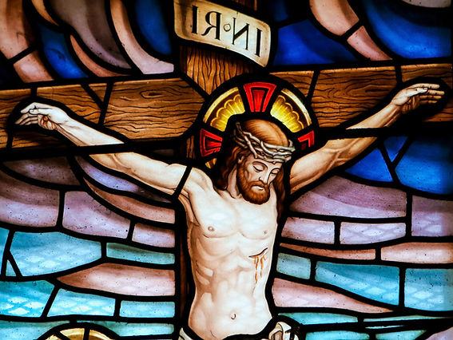
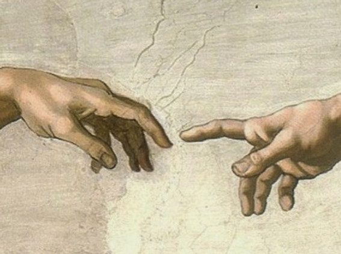

import RefreshOnFirstLoad from '@site/src/components/HomepageFeatures/RefreshOnFirstLoad';

<RefreshOnFirstLoad />

## (Jesus/Bible/Truth)


[cite_start]Here are some of the top questions students ask, including their answers according to the Bible[cite: 3].

***

### **01 Is the Bible factual?**
[cite_start]Would it surprise you to know that the books of the Bible are the most analyzed, researched, and historically reliable documents ever recorded? [cite: 6] [cite_start]There are nearly 6,000 surviving manuscripts of the New Testament alone, while the closest competitor, Homer's *The Iliad*, has only 600 existing copies[cite: 7]. [cite_start]Even more astonishing is the foretelling—prophesying—of future events with remarkable accuracy and clarity, such as the birth and exile of a Jewish nation, to the life, death, and resurrection of a Messiah, perfectly fulfilled in Jesus of Nazareth[cite: 8].


---

### **02 Does God exist?**
[cite_start]Before the world and universe came into existence, there had to be an **uncaused cause**[cite: 12]. [cite_start]The very fact we exist on a ball of liquid and solid iron, suspended in space, and spinning 1000 miles per hour is **evidence** there are forces at play that far exceed our own understanding[cite: 13]. [cite_start]The Bible states that "In the beginning was the Word... and the Word was God" (John 1:1)[cite: 14]. [cite_start]When God spoke to Moses—a revered Jewish leader in history—He states, "I AM WHO I AM" (Exodus 3:14)[cite: 15]. [cite_start]No matter how we think about it, there's simply no denying something or **Someone greater** is working for our good behind nature[cite: 16].



---

### **03 Was Jesus God?**
[cite_start]There are many examples in the Bible that point to Jesus as God[cite: 19]. [cite_start]He was foretold by ancient prophets as the Messiah, or "God-man" (Psalm 22; Isaiah 53), thousands of years before his birth[cite: 20]. [cite_start]While on earth he **performed miracles** that defied physics and logic, but more importantly—unquestionably the most substantial—Jesus was **crucified** and **rose from the dead** after three days (Matthew 28:1-10; Mark 16:1-8; Luke 24:1-10; John 20:1-18)[cite: 21]. [cite_start]Today, billions of people around the world believe in a literal historical Jesus—including some **agnostic scholars**—but the real challenge is, will they follow His teachings to the end? [cite: 22]



---

### **04 Is God just?**
[cite_start]This is one of the most challenging questions students ask[cite: 25]. [cite_start]In one example regarding God's **justice** we read that "Vengeance is Mine; I will repay" (Deuteronomy 32:35), while in another book it states, "The LORD is merciful and gracious, slow to anger and abounding in steadfast love" (Psalms 103:8)[cite: 26]. [cite_start]Jesus perfectly embodies the law God established, and can therefore respond to his accusers **without contradiction**—"You have heard that it was said, ‘Eye for eye, and tooth for tooth.’ But I tell you, do not resist an evil person... **love your enemies** and pray for those who persecute you" (Matthew 5:38,44)[cite: 27].


---

### **05 Aren't all religions fundamentally the same?**
[cite_start]The saying often goes, "there are many paths to get to heaven" [or truth, or reason, etc.][cite: 30]. [cite_start]With all the established religions and their respective gods, how can we know for sure that any of them are more true or superior to others? [cite: 31] [cite_start]In Luke's record of the **Acts of the Apostles**, he states of Jesus that "Salvation is found in no one else, for there is no other name under heaven given to mankind by which we must be saved" (Acts 4:12)[cite: 32]. [cite_start]Moreover, Jesus repeatedly referred to himself as being "**One**" with the Father/Creator (John 1:1; John 10:30, John 8:58)[cite: 33]. [cite_start]An important question to ask is why haven't the other prophets of major religions made these same claims? [cite: 34] [cite_start]If they have, how did they demonstrate it, and by what standard of truth can we compare it to? [cite: 35]


---

### **06 Why do people suffer?**
[cite_start]Contrary to popular teaching, the root of all evil is not money, but rather **selfishness**[cite: 38]. [cite_start]In the beginning, **sin**—separation from God—entered man's heart through our foreparents, Adam and Eve (Genesis 3:1-6)[cite: 39]. [cite_start]It was their **transgression** by violating God's command (seeking to elevate themselves to His level) which led humanity to the kind of **suffering and injustice** witnessed throughout time[cite: 40]. [cite_start]God responds to our fallen state by sacrificing Himself in the form of His son, Jesus, who takes the place of **all** our sins—past, present, future—so we may have everlasting life back with Him (Colossians 2:13-14)[cite: 41].


---

### **07 Isn't truth relative?**
[cite_start]We rely on **natural laws** to govern societies and protect the innocent, just as we depend on gravity and "unseen forces" to keep our feet firmly planted on the ground[cite: 44]. [cite_start]However, much of **post-modern culture** reflects a highly **subjective** and "feelings-based" approach toward truth and reality[cite: 45]. [cite_start]According to Aristotle's **Principle of Non-Contradiction**, one set of contradictory statements cannot be both equally true and equally false at the same time[cite: 46]. [cite_start]The Bible instead speaks of a God who is both unchanging—immutable—and eternally consistent, "Jesus Christ is the same yesterday and today and forever... Through him all things were made" (Hebrews 13:8; John 1:3)[cite: 47].


---

### **08 Is LGBTQA+ lifestyle acceptable?**
(What if they love Jesus?)
[cite_start]The issue of a person's lifestyle, or sexuality, has long been a topic of contention[cite: 51]. [cite_start]The Bible states that "God created man in His own image... **male and female** He created them... and they shall become **one flesh**" (Genesis 1:27,2:24)[cite: 52]. [cite_start]However, because of man's rebellious heart, "God gave them over to **shameful lusts**... [exchanging] natural sexual relations for unnatural ones" (Romans 1:26-27)[cite: 53]. [cite_start]In response to those who continue in this practice—even while sharing a love for God—Jesus says, “If you love me, you will keep my commandments" (John 14:15)[cite: 54].


---

### **09 Hasn't science disproved God?**
[cite_start]Some of the earliest scientific discoveries were made by avid Christians searching for God's fingerprints in nature[cite: 57]. [cite_start]Today, atheists and skeptics alike make various attempts to disprove the existence of God and other "supernatural phenomena" by **marginalizing** biblical truth as mere fantasy or, at best, speculatory[cite: 58]. [cite_start]However, the Bible claims that "since the creation of the world God's invisible qualities... have been clearly seen... so that people are without excuse" (Romans 1:20)[cite: 59]. [cite_start]In reality, it takes just as much **faith not to believe in God**, but that would presuppose there's some form of objective truth[cite: 60].


---

### **10 Is there an eternity? (Who goes?)**
[cite_start]Many religions and cultures throughout the world possess a concept of heaven, or "paradise", in their folklore[cite: 64]. [cite_start]Within the Judeo-Christian worldview, **God is the Creator of heaven** (Genesis 1:1), but more importantly, is who gets to spend eternity with Him[cite: 65]. [cite_start]Jesus claimed to have come from the Father in heaven (John 6:51), and promises "eternal life" to all who believe and follow His teachings (John 17:3)[cite: 66]. [cite_start]There is **no other way** to the Father apart from Jesus, since He is "the way and the truth and the life" (John 14:6), the only son of God (John 3:16; Mark 3:17) and bridge to eternity (1 Timothy 2:5)[cite: 67].
```
